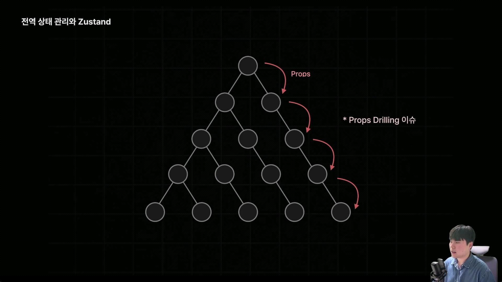
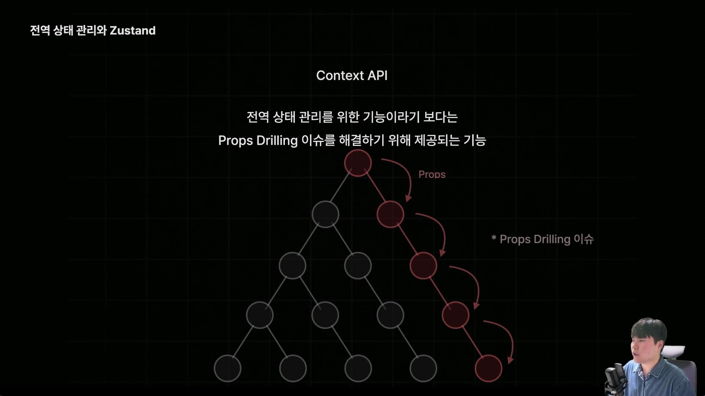
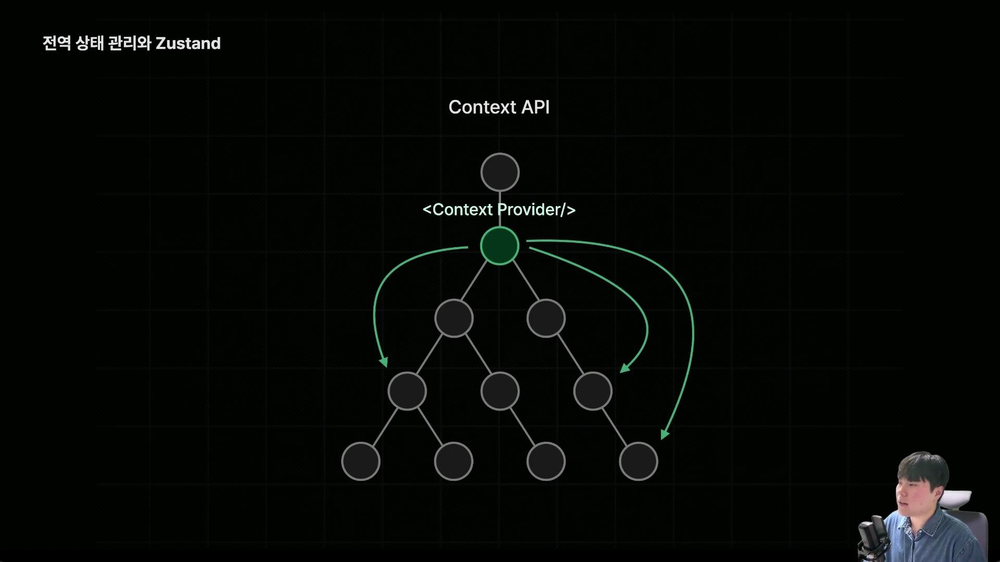
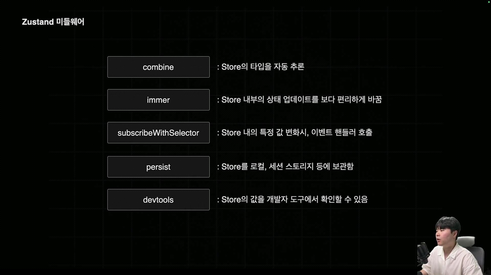

create는 zustand의 store를 생성하는 역할을 함
store란 전역상태인 state와 해당 상태를 실제로 업데이트하는 action함수들이 포함된 객체인 store를 생성함
get이라는 함수는 현재 객체의 스토어를 그대로 반환하는 역할을 함
set함수는 스토어의 상태를 변경하는 함수

create는 zustand에서 store를 생성하는 함수이다.
store는 전역상태값(state)과 전역상태를 업데이트하는 함수(action)를 담아두는 저장소로 컴포넌트들은 이 store에 접근해서 필요한 값을 꺼내쓰고 값이 변경되면 구독되있던 컴포넌트만 리렌더링된다.
전역상태란 여러 컴포넌트에서 불러와서 쓸 수 있는 값
글로벌한 상태값을 새롭게 생성,수정할 수 있도록 관리하는 것
주로 사용자 인증정보, 다크모드(테마정보)설정,장바구니 정보

전역상태 관리가 없으면 props만을 이용해서 상태를 전달하는데 이게 props drilling일어남 전달되는 프롭스가 복잡하고 많아지는 이슈
동시에 렌더링된다거나 암튼 성능저하
그래서 이런 문제를 해결하기위해 전역상태관리를 돕는 도구들
context api, redux ,zustand zotai 등 라이브러리가 있음

리액트 내부 훅인 ?context api도 전역상태관리의 도움되지만 단점이 있음
<Context Provider /> 를 추가하게되면 컨텍스트가 공급하는 데이터를 여러 컴포넌트에서 가져다가 쓸 수 있지만
Context Provider가 업데이트되면 컨텍스트 하위 컴포넌트들이 렌더링되는 단점이 있음
전역상태관리를 위한 기능이라기 보다는 props드리링 이슈 해결하기 위해 제공?

그래서 범용적인 전역 상태관리보다는 특정 부분에 한정된 데이터를 공유를 위해 더 자주 사용된다
zustand 미들웨어

combine을 사용하면 state는 state끼리 action함수는 action함수끼리 서로 분리해서 작성한뒤에 결합시킬 수 있음
코드상에서 명확한 분리를 할수 있음
타입스크립트가 store의 타입을 더 정확히 추론할 수 있게 해줌

npm i immer

immer는 불변성관리를 하기때문에 복잡하게 작성 할 필요가 없음
간단한 state보다는 깊어진 state같을때 좋음
